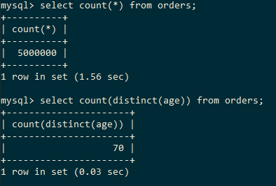

1. 插入orders表的插入方式操作描述，时间截图

在保存有`data1.txt`的目录下进入MySQL CLI，然后执行`load file local infile 'data1.txt' into table orders;`

2. 插入products表的插入方式操作描述，时间截图

在保存有`data2.txt`的目录下进入MySQL CLI，然后执行`load file local infile 'data2.txt' into table products;`

3. 问题1：在 orders 表中找出购买人年龄小于20岁的order列表。 

SQL: `select * from orders where age < 20;`

建立索引方式：在age列上建立B+树索引，`create index age_index on orders(age);`

理由：此为检索范围值的查询，可以在age上执行B+索引以加快此SQL查询的速度。（通过实践，发现最终结论是不应建立索引。原因请见本部分最后的分析和结论。）

建立索引前后执行效率截图：

前：
执行结果：

执行计划

可以看到type是ALL，即遍历表查询。

后：
执行结果：

执行计划

分析和结论：

创建索引前后执行结果并没有大区别，从explain可以看到查询的方法还是使用ALL遍历查询。即是说本例不应建立索引。

探索其原因，发现age列的选择性（即不同的取值个数和总数的比值）过低（如下图）。这样，如果通过索引去查询，也需要访问大量的（在这个例子里是571196个）索引来访问数据。由于程序局部性和cache的存在，当需要访问大量的索引的时候，通过索引访问数据可能并不能直接全表查询的速度更快。所以在这个例子中，数据库还是采取了直接全表查询的策略。

4. 问题2：在 orders 表中找出所有姓王的人的order列表。 

SQL: `select * from orders where name like '王%';`

建立索引方式：在name列上建立B+树索引，`create index name_index on orders(name);`

原因：此为前缀查询。

建立索引前后执行效率截图：

前：

执行结果：

执行计划：

可以看到type是ALL，即遍历表查询。

后：

执行结果：

执行计划：

分析：

从执行计划可以看到，此查询可以利用name上的B+索引。从执行结果可以看到，此索引加快了查询速度。

和第一个问题进行比对，可以看到name列的选择性较高（34772290 vs 70），所以此索引能够有效地增加查询效率。

5. 问题3：统计 orders 表中所有男性的人的数量。 

SQL：`select count(*) from orders where sex = '男';`

建立索引方式：在sex列上建立索引，`create index sex_index on orders(sex);`。

原因：这是个全值匹配，且根据生活常识，sex的不同取值数比较少，选择性比较高。所以B+索引将会有效地提高查询效率。更好的方法是建立hash索引，但是由于MySQL只有Memory引擎支持Hash索引，而Memory速度比较快，索引效果不显著。所以还是最终还是采用B+索引。

建立索引前后执行效率截图：

前：

执行结果：

执行计划：

后：

执行结果：

执行计划：

6. 问题4：在 orders 表中计算女性，姓张，年龄大于50，且消费小于100的人数。 

SQL：`select count(*) from orders where sex = '女' and name like '张%' and age > 50 and amount < 100;`

建立索引方式：依次在name, amount, age和sex列上建立B+复合索引，`create index orders_index on orders(name, amount, age, sex);`;

原因：此可以建立复合索引，并根据选择性从高到低（在此例子中，各列的选择性见下图）进行排序，以增加对此查询的索引效率。

建立索引前后执行效率截图：

前：

执行结果：

执行计划：

后：

执行结果：

执行计划：

 
7. 问题5：统计 orders 表中姓名为三个字的人数。

SQL: `select count(*) from orders where name like '___';`

建立索引方式：在name列上建立B+树索引，`create index name_three_index on orders(name);`;

原因：此为范围查询，且name列选择性比较高。

前：

执行结果：

执行计划：

后：

执行结果：

执行计划：

分析：

在这个例子中可以看出，虽然索引对查询结果有一定的提升，但是实际提升效果不大（300ms级别）。推测可能是因为通过索引查询到的索引数量过多（2501252，超过了50%），造成通过索引访问数据时的时间花费。

8. 问题6：在 products 表中查找库存大于150的product列表。

SQL：`select * from products where nums>150;`

建立索引方式：B+树索引，`create index nums_index on products(nums);`

原因：是个范围查询。

建立索引前后执行效率截图：

前：

执行结果：

执行计划：

后：

执行结果：

执行计划：
