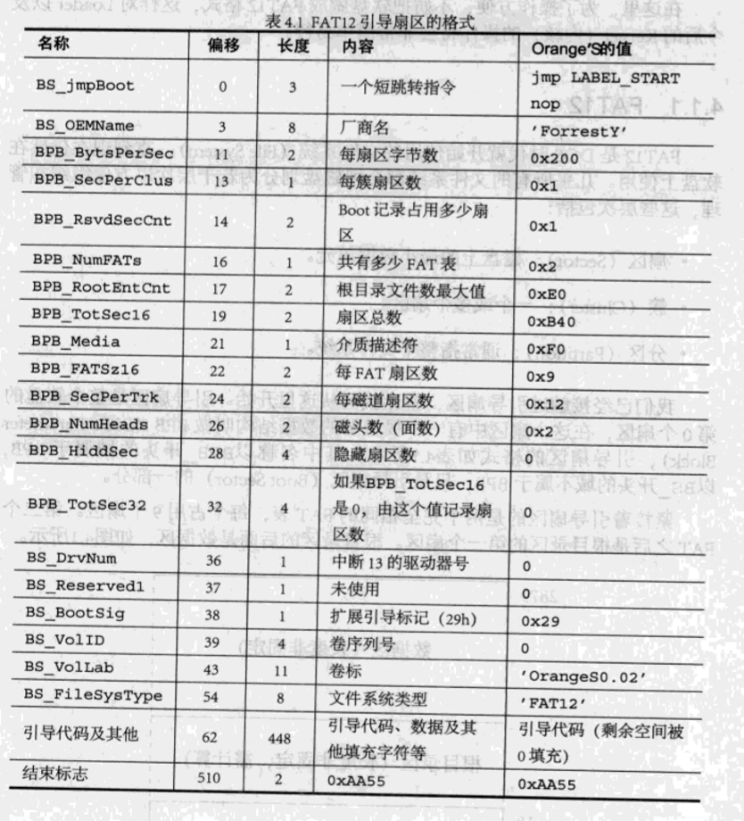

# 答案

http://www.techbulo.com/708.html

## 1. 实模式下的寻址方式以及实模式的缺陷

段寄存器*16+偏移量

缺陷：没有内存访问保护（想读就读，想写就写）；无法支持多任务（一切都是真实地址）

## 2. 保护模式下的寻址过程

### 2.1 段寄存器中存储的是什么？

descriptor在descriptor table中的位置，也就是选择子

### 2.2 GDT是啥？LDT是啥？LDT和GDT的区别是啥？

GDT：Global Descriptor Table，全局描述符表

LDT：Local Descriptor Table，局部描述符表

根据选择子第三位区分

内容一致，但LDT不是全局的。LDT存放当前进程的descriptor table，GDT存放对于全部进程的descriptor table

### 2.3 如何定位到Descriptor？Descriptor的内容有哪些？

因为GDT是一张，LDT是每个进程一张；可以理解成GDT为一级描述符表，LDT为二级描述符表。GDT里面放了放了许多描述符，也包括各个LDT的描述符。查LDT的的话，

1. 还是先从GDTR寄存器中获得GDT基址。

2. 从LDTR寄存器中获取LDT所在段的位置索引(LDTR高13位)。

3. 以这个位置索引在GDT中得到LDT段描述符从而得到LDT段基址。

4. 用段选择器高13位位置索引值从LDT段中得到段描述符。

5. 段描述符符包含段的基址、限长、优先级等各种属性，这就得到了段的起始地址（基址），再以基址加上偏移地址yyyyyyyy才得到最后的线性地址。

进程从LDTR寄存器中获得LDT的位置然后发起查询，如果是GDT，则根据GDTR和段寄存器中的内容定位到描述符；若是LDT，那么则根据选择子和GDTR中的内容定位。

Segment descriptor，用来把逻辑地址翻译成线性地址，是GDT/LDT的一项。在80286下descriptor有8字节长，包含如下内容：

31:24, 23, 22, 21, 20, 19:16, 15, 14:13, 12, 11:8, 7: 0
段基址:31:24, ...

1. 段基址32位，拆成了三份
2. 段长
3. 权限信息
4. 控制字节

### 3. 选择子的作用？选择子是什么？它的值存放在哪里？选择子里面的内容有哪些？为什么偏移地址大小是13位？

选择子是描述符在描述符表是的相对偏移，值在段寄存器里。

16位

13索引|1TI|2RPL

内容：
(1) 索引值(index)：给出了描述符在GDT或LDT中的索引项号；

(2) 表指示标志TI(Table Index)：TI=0 描述符在GDT中,TI＝1 描述符在LDT

(3) 请求特权级RPL(Requested Privilege Level)：0，1，2，3三个特权级。

GDTR是一个48位寄存器，32位段地址，16位段限（就是长度）（最大64K）。每个描述符8字节，所以最多64K/8=8K个描述符。13位正好寻址8K个。

### 4. 描述符的作用

描述段是否在内存中、段起始地址、界限、属性等。

### 5. GDTR/LDTR的作用：GDTR的内容是什么？LDTR的内容是什么？为什么LDT要放在GDT中？

GDTR内容，存放GDT的地址，给CPU查找GDT提供地址

32位基地址|16位表界限（也就是大小）

LDTR的内容是一个段选择子，因为LDR是一段内存，就是一个段

因为GDT是一张，LDT是每个进程一张；可以理解成GDT为一级描述符表，LDT为二级描述符表。GDT里面放了放了许多描述符，也包括各个LDT的描述符。查LDT的的话，

1. 还是先从GDTR寄存器中获得GDT基址。

2. 从LDTR寄存器中获取LDT所在段的位置索引(LDTR高13位)。

3. 以这个位置索引在GDT中得到LDT段描述符从而得到LDT段基址。

4. 用段选择器高13位位置索引值从LDT段中得到段描述符。

5. 段描述符符包含段的基址、限长、优先级等各种属性，这就得到了段的起始地址（基址），再以基址加上偏移地址yyyyyyyy才得到最后的线性地址。

### 6. 根目录区的大小是一定吗？扇区号是多少？为什么？

不一定，通过BPB_RootEntCnt（根目录文件数的最大值，比如0xE0）来计算根目录的大小，具体计算公式是

根目录区占用扇区数 = RootDirSectors = (BPB_RootEntCnt*0x20(一个目录项占0x20个字节))/BPB_BytesPerSec（一个扇区的字节数，比如0x200）

典型值：19

### 7. 数据区的第一个簇号是多少？为什么？

不一定，通过根目录大小来计算，具体计算公式是

DataSectors = RootDirSectors + 1（引导扇区）+9 (FAT1) + 9 (FAT2)

典型值：33

当BPB_SecPerClus=1时，扇区号就是簇号

### 8. FAT表的作用？

组成簇链，用来按顺序查找文件所占用的所有扇区，从而读取文件的内容。

### 9. 解释静态链接的过程

http://www.cnblogs.com/acSzz/p/5743789.html

静态链接是指在编译阶段直接把静态库加入到可执行文件中去，这样可执行文件会比较大。

而动态链接则是指链接阶段仅仅只加入一些描述信息，而程序执行时再从系统中把相应动态库加载到内存中去。

相似段合并，空间和地址的分配；符号解析，重定位

静态链接就是在编译链接时直接将需要的执行代码拷贝到调用处。

感觉应该是把需要执行的代码复制进可执行文件里。

### 10. 解释动态链接的过程

每遇到一个共享模块，都会在代码段有个GOT（全局偏移表），存储外部变量的地址。  

#### 动态链接器自举：

Linux下ld.so，启动后首先找到自己的GOT（全局偏移表），获得本身的重定位表和符号表，得到自己的重定位入口。

#### 装载共享对象

首先将可执行文件和链接器本身符号表合并。然后从.dynamic段中找到DT_NEEDED类型，开始装载所有共享对象，装载一个合并一个符号表。

#### 重定位

修正所有文件和对象的重定位表。

装载共享对象；重定位和初始化

使用这种方式的程序并不在一开始就完成动态链接，而是直到真正调用动态库代码时，载入程序才计算(被调用的那部分)动态代码的逻辑地址

### 11. 静态链接相关PPT中为什么使⽤ld链接⽽不是gcc

gcc会自动链接操作系统的库，有时我们并不想这么操作。ld就老实多了，只会链接参数中所规定的。

### 12. linux下可执⾏⽂件的虚拟地址空间默认从哪⾥开始分配

0x08048000

### 13. BPB指定字段的含义

其他的代码有注释

